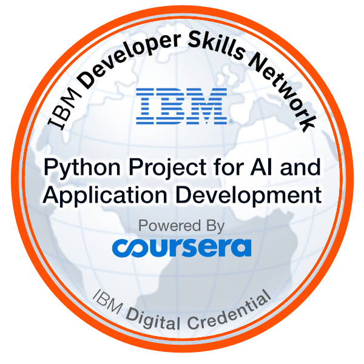

<!--  Profile Widget  -->

<!-- Reference: https://github.com/Jurredr/github-widgetbox -->

<!-- -------Header------- -->

  

<!-- Bio -->
- 👋 Hello! I'm Jhon Maldonado, a Software Engineering student with a strong foundation and notable projects
- 💪 I'm skilled in back-end development. 
- 🔭 Currently looking for a job as a Back-end Developer.
- ⚙️ My advanced skills include Python, SQL, Django, Flask, PostgreSQL, MySQL, APIs RESTful, Docker, Git, GitHub .
- 🌱 And also expanding my knowledge in devops(docker, kubernates, CI/CD).
- 👯 I’m looking to collaborate with other content creators and developers.
- 📢 Love to teach and inspire students.
- 🥅 2023 Goals: Expand my knowledge and skills in software development.
- 📫 How to reach me **jhonmaldonado54@gmail.com**
- 📩 Don't hesitate to reach out & let's connect and start a conversation. 📞
- 🤝 Let's connect and explore how I can contribute to your projects or provide valuable insights. Together, we can create remarkable digital solutions that leave a lasting impact. 💼✨

## 🤝🏻 &nbsp;Connect with Me

<h2><i>🏅 Awards &  Badges</i></h2>

    
   
   
   

   

   

   
   
   

   
    

## 🧑‍💻 Tech Stack 🛠️

<!-- tech stack -->

<!-- reference = https://github.com/tandpfun/skill-icons -->
 

  <a href="https://github.com/jhonmaldonado5454">
    
  </a>

